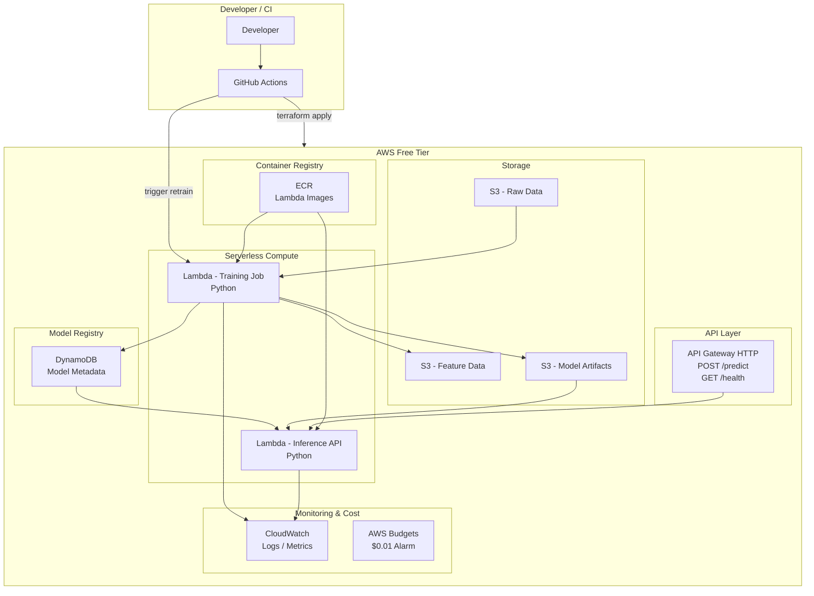

# terraform-mlops-pipeline


[English](README.md) | [繁體中文](README_zh-TW.md)

## 🎯 Project Positioning

> **Built an end-to-end MLOps pipeline on AWS (Free Tier) using Terraform, enabling automated training, evaluation, model registry, canary deployment, and rollback with cost guardrails.**

## 📦 Architecture



## 💰 Free Tier Compliance

| Service | Free Tier Limit | Expected Usage | Status |
|---------|----------------|----------------|--------|
| S3 | 5GB storage, 20K GET/mo | ~100MB | ✅ |
| DynamoDB | 25GB, 25 WCU/RCU | ~1MB | ✅ |
| Lambda | 1M req + 400K GB-s/mo | ~100 req | ✅ |
| API Gateway | 1M calls/mo (12mo) | ~100 calls | ✅ |
| CloudWatch | 10 metrics, 5GB logs | Minimal | ✅ |
| ECR | 500MB storage | ~200MB | ✅ |

### Cost Guardrails
- **AWS Budgets**: $0.01 threshold alarm with email notification
- **ECR Lifecycle**: Keep only last 5 images
- **S3 Lifecycle**: Auto-delete model artifacts after 30 days
- **Lambda Limits**: Training timeout 15min, memory capped
- **Terraform Configuration**: `infra/` (See [Setup Guide](docs/terraform.md))
- **Terraform Tags**: All resources tagged with `Project` + `Environment`

## 🚀 Core Features

1. **Feature pipeline (Python)**: Lambda-based feature engineering
2. **Automated training**: Lambda with 15-min timeout
3. **Model registry**: DynamoDB metadata + S3 artifacts (versioned)
4. **Inference API**: Lambda behind API Gateway
5. **Canary deployment**: Lambda alias weighted routing
6. **Model rollback**: Update DynamoDB metadata — no redeploy needed
7. **Infra as Code**: Terraform modular design
8. **Cost guardrails**: AWS Budgets alarm at $0.01

## 🛠 Tech Stack

- **Infrastructure**: Terraform, AWS (Free Tier)
- **ML/Data**: Python (Pandas, Scikit-learn)
- **Serving**: Python Lambda (container image)
- **CI/CD**: GitHub Actions
- **Database**: DynamoDB (Metadata), S3 (Artifacts)

## 📂 Project Structure

```text
terraform-mlops-pipeline/
├── infra/                  # Terraform
│   ├── modules/
│   │   ├── s3/             # Raw, Feature, Model buckets
│   │   ├── dynamodb/       # Model registry table
│   │   ├── lambda/         # Training + Inference functions
│   │   ├── api_gateway/    # HTTP API
│   │   ├── ecr/            # Container registry
│   │   ├── iam/            # Least-privilege roles
│   │   ├── cloudwatch/     # Logs & metrics
│   │   └── budgets/        # Cost alarm
│   ├── envs/
│   │   ├── dev/
│   │   └── prod/
│   ├── main.tf
│   ├── variables.tf
│   ├── providers.tf
│   └── versions.tf
├── training/               # Python ML
├── inference/              # Inference handler
├── registry/               # Schema docs
├── ci/                     # GitHub Actions (See docs/cicd.md)
└── docs/                   # Architecture (docs/architecture.md) & Decisions (docs/decisions.md)
```
