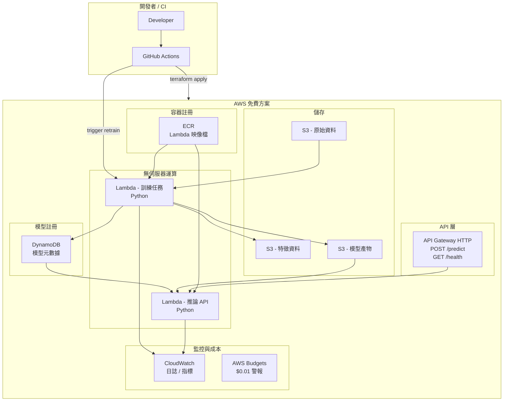

# AWS 免費方案 MLOps 流水線


[English](README.md) | [繁體中文](README_zh-TW.md)

## 🎯 專案定位

> **使用 Terraform 在 AWS (免費方案) 上建置端到端的 MLOps 流水線，實現自動化訓練、評估、模型註冊、金絲雀部署 (Canary Deployment) 和回滾，並設有成本控制機制。**

## 📦 架構



## 💰 免費方案合規性

| 服務 | 免費方案限制 | 預期用量 | 狀態 |
|---------|----------------|----------------|--------|
| S3 | 5GB 儲存, 2萬 GET/月 | ~100MB | ✅ |
| DynamoDB | 25GB, 25 WCU/RCU | ~1MB | ✅ |
| Lambda | 100萬請求 + 40萬 GB-秒/月 | ~100 請求 | ✅ |
| API Gateway | 100萬呼叫/月 (12個月) | ~100 呼叫 | ✅ |
| CloudWatch | 10 個指標, 5GB 日誌 | 極少 | ✅ |
| ECR | 500MB 儲存 | ~200MB | ✅ |

### 成本防護機制 (Cost Guardrails)
- **AWS Budgets**: 設定 $0.01 閾值警報，並發送電子郵件通知
- **ECR Lifecycle**: 僅保留最近 5 個映像檔
- **S3 Lifecycle**: 30 天後自動刪除模型產物
- **Lambda 限制**: 訓練超時設定為 15 分鐘，記憶體設有上限
- **Terraform 標籤**: 所有資源皆標記 `Project` + `Environment`

## 🚀 核心功能

1. **特徵流水線 (Python)**: 基於 Lambda 的特徵工程
2. **自動化訓練**: 具備 15 分鐘超時限制的 Lambda
3. **模型註冊**: DynamoDB 元數據 + S3 產物 (版本化)
4. **推論 API**: API Gateway 後端的 Lambda
5. **金絲雀部署**: Lambda 別名權重路由 (Weighted Routing)
6. **模型回滾**: 更新 DynamoDB 元數據 — 無需重新部署
7. **基礎設施即程式碼 (IaC)**: Terraform 模組化設計
8. **成本防護**: AWS Budgets 設定 $0.01警報

## 🛠 技術棧

- **基礎設施**: Terraform, AWS (免費方案)
- **ML/數據**: Python (Pandas, Scikit-learn)
- **服務**: Python Lambda (容器映像檔)
- **CI/CD**: GitHub Actions
- **資料庫**: DynamoDB (元數據), S3 (產物)

## 📂 專案結構

```text
terraform-mlops-pipeline/
├── infra/                  # Terraform 基礎設施
│   ├── modules/
│   │   ├── s3/             # 原始、特徵、模型儲存桶
│   │   ├── dynamodb/       # 模型註冊表
│   │   ├── lambda/         # 訓練 + 推論函數
│   │   ├── api_gateway/    # HTTP API
│   │   ├── ecr/            # 容器註冊表
│   │   ├── iam/            # 最小權限角色
│   │   ├── cloudwatch/     # 日誌 & 指標
│   │   └── budgets/        # 成本警報
│   ├── envs/
│   │   ├── dev/
│   │   └── prod/
│   ├── main.tf
│   ├── variables.tf
│   ├── providers.tf
│   └── versions.tf
├── training/               # Python 機器學習訓練代碼
├── inference/              # 推論處理程式
├── registry/               # 架構文件
├── ci/                     # GitHub Actions 設定 (詳見 docs/cicd_zh-TW.md)
├── ci/                     # GitHub Actions 設定 (詳見 docs/cicd_zh-TW.md)
└── docs/                   # 架構 (docs/architecture_zh-TW.md) 與 決策 (docs/decisions_zh-TW.md)
```
