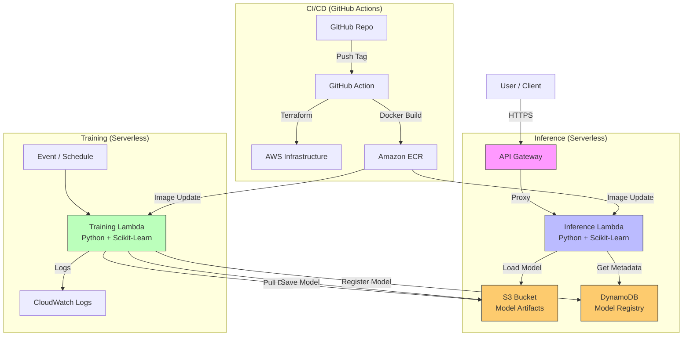

# Architecture Documentation

[English](architecture.md) | [繁體中文](architecture_zh-TW.md)

This document details the architecture of the Serverless MLOps pipeline on AWS Free Tier.

## High-Level Architecture

The pipeline is entirely serverless to maximize cost efficency (Free Tier eligible).

## Component Details

### 1. Infrastructure (Terraform)
*   **State Management**: Local state (for simplicity) or S3 remote state.
*   **Modules**:
    *   `s3`: Stores training data and model artifacts (`.joblib`).
    *   `dynamodb`: Stores model metadata (metrics, version, lineage).
    *   `lambda`: Python container images for Training and Inference.
    *   `api_gateway`: Exposes the Inference Lambda via HTTP API.
    *   `ecr`: Stores Docker container images.
    *   `iam`: Least-privilege roles for execution.
    *   `budgets`: Cost guardrails ($0.01 limit).

### 2. Training Pipeline
*   **Compute**: AWS Lambda (Container Image).
*   **Image**: Python 3.9 base, includes `scikit-learn`, `pandas`, `boto3`.
*   **Process**:
    1.  Fetch dataset from S3.
    2.  Train Random Forest model.
    3.  Evaluate metrics (Accuracy, F1).
    4.  Save model artifact to S3 (`models/vX.Y.Z/model.joblib`).
    5.  Log metadata to DynamoDB.

### 3. Model Registry
*   **Storage**: S3 for large files (weights), DynamoDB for metadata.
*   **Versioning**: Semantic versioning managed via DynamoDB items.

### 4. Inference API
*   **Compute**: AWS Lambda (Container Image) optimized for low latency.
*   **Routing**: AWS API Gateway (HTTP API).
*   **Flow**:
    1.  Receives JSON payload.
    2.  Loads model from S3 (cached in `/tmp` for warm starts).
    3.  Returns prediction.
