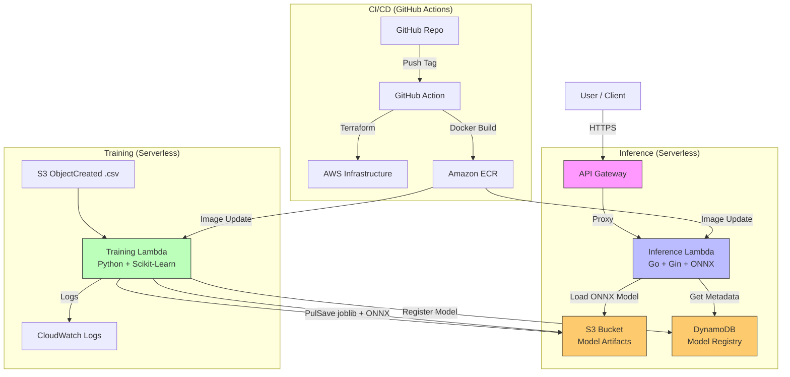

# Architecture Documentation

[English](architecture.md) | [繁體中文](architecture_zh-TW.md)

This document details the architecture of the Serverless MLOps pipeline on AWS Free Tier.

## High-Level Architecture

The pipeline is entirely serverless to maximize cost efficency (Free Tier eligible).

```mermaid
graph TD
    User[User / Client] -->|HTTPS| APIGW[API Gateway]
    
    subgraph "Inference (Serverless)"
        APIGW -->|Proxy| InferenceLambda[Inference Lambda<br/> Go + Gin + ONNX]
        InferenceLambda -->|Load ONNX Model| S3[S3 Bucket<br/> Model Artifacts]
        InferenceLambda -->|Get Metadata| DDB[DynamoDB<br/> Model Registry]
    end

    subgraph "Training (Serverless)"
        Trigger[S3 ObjectCreated .csv] --> TrainingLambda[Training Lambda<br/> Python + Scikit-Learn]
        TrainingLambda -->|Pull Data| S3
        TrainingLambda -->|Save joblib + ONNX| S3
        TrainingLambda -->|Register Model| DDB
        TrainingLambda -->|Logs| CW[CloudWatch Logs]
    end

    subgraph "CI/CD (GitHub Actions)"
        Git[GitHub Repo] -->|Push Tag| Action[GitHub Action]
        Action -->|Terraform| Infra[AWS Infrastructure]
        Action -->|Docker Build| ECR[Amazon ECR]
        ECR -->|Image Update| InferenceLambda
        ECR -->|Image Update| TrainingLambda
    end

    style APIGW fill:#f9f,stroke:#333
    style InferenceLambda fill:#bbf,stroke:#333
    style TrainingLambda fill:#bfb,stroke:#333
    style S3 fill:#fdcb6e,stroke:#333
    style DDB fill:#fdcb6e,stroke:#333
```

## Component Details

### 1. Infrastructure (Terraform)
*   **State Management**: Local state (for simplicity) or S3 remote state.
*   **Modules**:
    *   `s3`: Stores training data and model artifacts (`.joblib` + `.onnx`).
    *   `dynamodb`: Stores model metadata (metrics, version, lineage, `OnnxUrl`).
    *   `lambda`: Container images — Python for training, Go for inference.
    *   `api_gateway`: Exposes the Inference Lambda via HTTP API.
    *   `ecr`: Stores Docker container images.
    *   `iam`: Least-privilege roles for execution.
    *   `budgets`: Cost guardrails ($0.01 limit).

### 2. Training Pipeline
*   **Compute**: AWS Lambda (Container Image).
*   **Image**: Python 3.9 base, includes `scikit-learn`, `pandas`, `boto3`, `skl2onnx`.
*   **Trigger**: S3 `ObjectCreated` on `.csv` uploads to the raw bucket (event-driven).
*   **Process**:
    1.  Fetch dataset from S3.
    2.  Train `RandomForestRegressor` model.
    3.  Evaluate metrics (RMSE, MAE).
    4.  Save artifacts to S3 (`stock-prediction/<version>/model.joblib` and `model.onnx`).
    5.  Log metadata to DynamoDB (`ArtifactUrl`, `OnnxUrl`, metrics, status).

### 3. Model Registry
*   **Storage**: S3 for large files (weights), DynamoDB for metadata.
*   **Versioning**: Timestamp versions (e.g. `v20231027120000`) managed via DynamoDB items.
*   **Serving contract**: Inference loads the ONNX artifact via `OnnxUrl`.

### 4. Inference API
*   **Compute**: AWS Lambda (Container Image) — Go + Gin + ONNX Runtime.
*   **Routing**: AWS API Gateway (HTTP API) — `POST /predict`, `GET /health`.
*   **Flow**:
    1.  Receives JSON payload (`features: []float32`, length 4).
    2.  Resolves latest `stable` / `canary` model from DynamoDB.
    3.  Downloads ONNX from S3 (cached in memory / `/tmp` for warm starts).
    4.  Runs ONNX Runtime inference and returns `predicted_price` + `model_version`.
