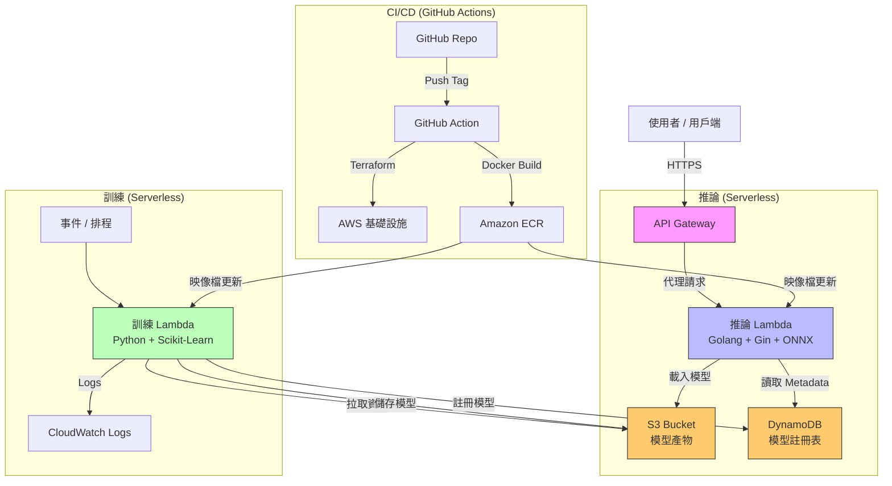

# 架構文件

[English](architecture.md) | [繁體中文](architecture_zh-TW.md)

本文件詳細說明 AWS Free Tier Serverless MLOps 流水線的架構設計。

## 高層架構圖

為了最大化成本效益 (符合 Free Tier 資格)，本流水線採用全 Serverless 架構。

## 組件細節

### 1. 基礎設施 (Terraform)
*   **狀態管理**: 本地狀態 (Local State，為求簡化) 或 S3 遠端狀態。
*   **模組 (Modules)**:
    *   `s3`: 儲存訓練資料與模型產物 (`.joblib`)。
    *   `dynamodb`: 儲存模型 Metadata (指標、版本、血緣)。
    *   `lambda`: 執行 Python 容器映像檔 (訓練與推論)。
    *   `api_gateway`: 透過 HTTP API 暴露推論服務。
    *   `ecr`: 儲存 Docker 容器映像檔。
    *   `iam`: 最小權限執行角色。
    *   `budgets`: 成本預算監控 ($0.01 限制)。

### 2. 訓練流水線 (Training Pipeline)
> 詳細流程請參考: [模型訓練流程](training_process_zh-TW.md)

*   **運算資源**: AWS Lambda (Container Image)。
*   **映像檔**: 基於 Python 3.9，包含 `scikit-learn`, `pandas`, `boto3`。
*   **流程**:
    1.  從 S3 拉取資料集。
    2.  訓練 Random Forest 模型。
    3.  評估模型指標 (Accuracy, F1)。
    4.  儲存模型產物至 S3 (`models/vX.Y.Z/model.joblib`)。
    5.  寫入 Metadata 至 DynamoDB。

### 3. 模型註冊表 (Model Registry)
*   **儲存**: S3 用於大型檔案 (權重)，DynamoDB 用於 Metadata。
*   **版本控制**: 透過 DynamoDB Items 管理語意化版本 (Semantic Versioning)。

### 4. 推論 API (Inference API)
*   **運算資源**: AWS Lambda (Container Image)，針對低延遲優化。
*   **路由**: AWS API Gateway (HTTP API)。
*   **流程**:
    1.  接收 JSON 請求。
    2.  從 S3 載入模型 (快取於 `/tmp` 以加速 Warm Start)。
    3.  回傳預測結果。
