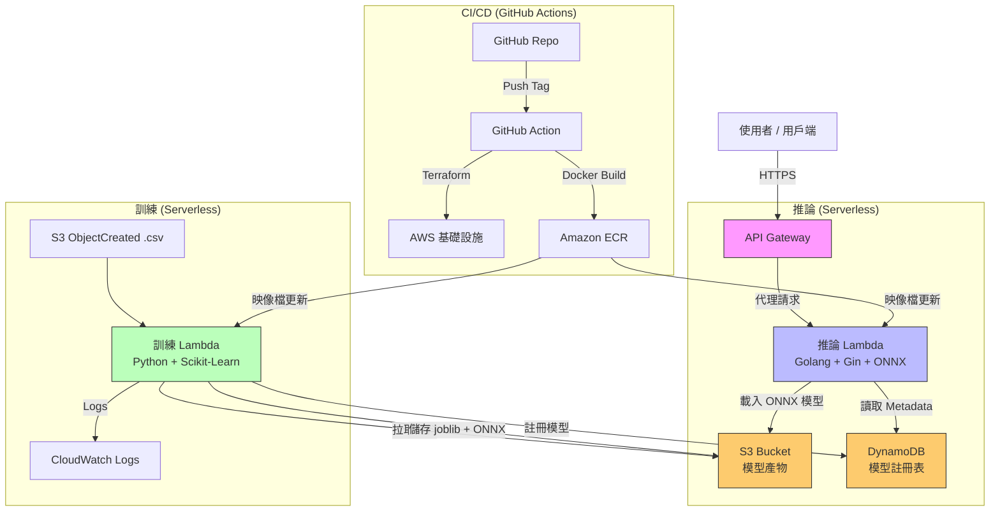

# 架構文件

[English](architecture.md) | [繁體中文](architecture_zh-TW.md)

本文件詳細說明 AWS Free Tier Serverless MLOps 流水線的架構設計。

## 高層架構圖

為了最大化成本效益 (符合 Free Tier 資格)，本流水線採用全 Serverless 架構。

```mermaid
graph TD
    User[使用者 / 用戶端] -->|HTTPS| APIGW[API Gateway]
    
    subgraph "推論 (Serverless)"
        APIGW -->|代理請求| InferenceLambda[推論 Lambda<br/> Golang + Gin + ONNX]
        InferenceLambda -->|載入 ONNX 模型| S3[S3 Bucket<br/>模型產物]
        InferenceLambda -->|讀取 Metadata| DDB[DynamoDB<br/>模型註冊表]
    end

    subgraph "訓練 (Serverless)"
        Trigger[S3 ObjectCreated .csv] --> TrainingLambda[訓練 Lambda<br/> Python + Scikit-Learn]
        TrainingLambda -->|拉取資料| S3
        TrainingLambda -->|儲存 joblib + ONNX| S3
        TrainingLambda -->|註冊模型| DDB
        TrainingLambda -->|Logs| CW[CloudWatch Logs]
    end

    subgraph "CI/CD (GitHub Actions)"
        Git[GitHub Repo] -->|Push Tag| Action[GitHub Action]
        Action -->|Terraform| Infra[AWS 基礎設施]
        Action -->|Docker Build| ECR[Amazon ECR]
        ECR -->|映像檔更新| InferenceLambda
        ECR -->|映像檔更新| TrainingLambda
    end

    style APIGW fill:#f9f,stroke:#333
    style InferenceLambda fill:#bbf,stroke:#333
    style TrainingLambda fill:#bfb,stroke:#333
    style S3 fill:#fdcb6e,stroke:#333
    style DDB fill:#fdcb6e,stroke:#333
```

## 組件細節

### 1. 基礎設施 (Terraform)
*   **狀態管理**: 本地狀態 (Local State，為求簡化) 或 S3 遠端狀態。
*   **模組 (Modules)**:
    *   `s3`: 儲存訓練資料與模型產物 (`.joblib` + `.onnx`)。
    *   `dynamodb`: 儲存模型 Metadata (指標、版本、血緣、`OnnxUrl`)。
    *   `lambda`: 容器映像檔 — 訓練用 Python、推論用 Go。
    *   `api_gateway`: 透過 HTTP API 暴露推論服務。
    *   `ecr`: 儲存 Docker 容器映像檔。
    *   `iam`: 最小權限執行角色。
    *   `budgets`: 成本預算監控 ($0.01 限制)。
    *   `cloudwatch`: Lambda log groups 位於 `/aws/lambda/...`，API Gateway access logs 位於 `/aws/apigateway/...`；SNS email 告警涵蓋 Lambda Errors/Duration 與 API 5xx。首次 apply 後請確認 SNS 訂閱信。

### 2. 訓練流水線 (Training Pipeline)
> 詳細流程請參考: [模型訓練流程](training_process_zh-TW.md)

*   **運算資源**: AWS Lambda (Container Image)。
*   **映像檔**: 基於 Python 3.9，包含 `scikit-learn`, `pandas`, `boto3`, `skl2onnx`。
*   **觸發**: Raw Bucket 上傳 `.csv` 時的 S3 `ObjectCreated` 事件。
*   **流程**:
    1.  從 S3 拉取資料集。
    2.  訓練 `RandomForestRegressor` 模型。
    3.  評估模型指標 (RMSE, MAE)。
    4.  儲存模型產物至 S3 (`stock-prediction/<version>/model.joblib` 與 `model.onnx`)。
    5.  寫入 Metadata 至 DynamoDB (`ArtifactUrl`, `OnnxUrl`, 指標, 狀態)。

### 3. 模型註冊表 (Model Registry)
*   **儲存**: S3 用於大型檔案 (權重)，DynamoDB 用於 Metadata。
*   **版本控制**: 透過 DynamoDB Items 管理時間戳版本 (例如 `v20231027120000`)。
*   **服務契約**: 推論端透過 `OnnxUrl` 載入 ONNX 產物。

### 4. 推論 API (Inference API)
*   **運算資源**: AWS Lambda (Container Image) — Go + Gin + ONNX Runtime。
*   **路由**: AWS API Gateway (HTTP API) — `POST /predict`, `GET /health`。
*   **流程**:
    1.  接收 JSON 請求 (`features: []float32`，長度 4)。
    2.  從 DynamoDB 解析最新 `stable` / `canary` 模型。
    3.  從 S3 下載 ONNX（Warm Start 時快取於記憶體 / `/tmp`）。
    4.  以 ONNX Runtime 推論，回傳 `predicted_price` 與 `model_version`。
