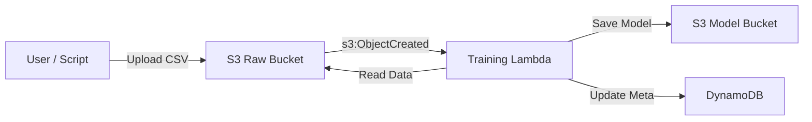

# Event-Driven MLOps 架構設計

## 1. 概述
本文件描述了 MLOps 平台的 Event-Driven 自動化訓練機制。
目標是實現「當新數據進入時，自動觸發模型訓練與更新」，同時確保架構簡單且符合 AWS Free Tier 限制。

## 2. 架構圖

## 3. 工作流程
1.  **資料上傳**: 使用者或 `make fetch-data` 腳本將股票數據 (`.csv`) 上傳至 `S3 Raw Bucket`。
2.  **事件觸發**: S3 Bucket 設定了 Notification，當偵測到 `.csv` 檔案建立 (`PutObject`)，即發送事件給 `Training Lambda`。
3.  **模型訓練**:
    -   Lambda 接收事件，解析出 Bucket 名稱與檔案路徑 (Key)。
    -   讀取該 CSV 檔案進行特徵工程與模型訓練。
    -   評估模型指標 (RMSE, MAE)。
4.  **模型發布**:
    -   訓練完成的模型 (`.joblib`) 儲存至 `S3 Model Bucket`。
    -   模型元數據 (Metrics, Version, Location) 寫入 `DynamoDB`。

## 4. Free Tier 成本評估 (Cost Analysis)
本架構經過優化，確保在 AWS Free Tier 額度內運行。

| 服務 | Free Tier 額度 | 預估消耗 (每次訓練) | 安全執行次數/月 | 備註 |
| :--- | :--- | :--- | :--- | :--- |
| **S3** | 5GB Storage / 20k Requests | 微量 (視資料大小) | N/A | S3 Event 本身免費 |
| **Lambda** | 400,000 GB-seconds | ~150 GB-seconds | **~2,600 次** | 假設每次訓練 5 分鐘, 512MB RAM |
| **DynamoDB** | 25GB Storage / 25 WCUs | 1 WCU (寫入一次) | 無限 | 遠低於限制 |

**結論**: 即使每天自動更新模型一次 (30次/月)，消耗的資源也不到 Free Tier 額度的 2%，極度安全。

## 5. 擴展性考量
- **錯誤處理**: Lambda 內建 Retry 機制 (預設 2 次)。若需更進階處理，可設定 Dead Letter Queue (DLQ)。
- **並發控制**: 目前無特別限制。若同時上傳大量檔案，Lambda 會平行執行 (需注意 AWS 並發上限，但在 Free Tier 專案中通常不是問題)。
